# tGD

<p align="center">
  
  
  
  
  
</p>

<p align="center">
  <a href="README.md">English</a> | <a href="README.zh-TW.md">繁體中文</a> | <a href="README.ja.md">日本語</a> | <a href="README.de.md">Deutsch</a>
</p>
<p align="center">
  <a href="https://openclawyhwang-hub.github.io/tGD/">🌐 GitHub Pages</a> &nbsp;|&nbsp; <a href="https://openclawyhwang-hub.github.io/tGD/tGD-intro.html">🎬 Intro</a>
</p>

**あなたのAIエージェントが500行のコードを書いた。でも、テストは走らせた？コードベースは読んだ？specは書いた？**

**たぶん、書いてない。**

tGDは8段階のパイプラインで、エージェントにあなたと同じワークフローを強制します：
Map → Define → Plan → Develop → Verify → Review → Ship

近道なし。「たぶん動く」なし。証拠だけ。

Claude Code、Codex CLI、Gemini CLI、OpenCode、Pi Coding Agent に対応。

---

## 🤔 なぜ tGD なのか？

**❌ tGD なし：**
- AIエージェントが500行のコードを書き、テストが失敗する。原因不明
- 「私のマシンでは動くのに」→ 本番環境で障害
- 仕様も計画もない、ただの感覚頼り

**✅ tGD あり：**
- エージェントが50行書き、テストが通り、次のタスクへ
- すべての機能に出荷前に PRD + SPEC + DESIGN がある
- 8段階のパイプラインがバグを本番到達前に検出

---

## 🎯 誰のため？

| あなたの役割 | tGD の活用法 |
|--------------|-------------|
| **個人開発者** | AI支援ワークフローでより速く出荷 |
| **チームリード** | AI生成コードにコーディング標準を強制 |
| **スタートアップ** | 壊さずに速く動く |
| **エンタープライズ** | AI開発の品質ゲートを維持 |

---

## 🚀 クイックスタート

### 1. Clone & セットアップ
```bash
git clone https://github.com/openclawyhwang-hub/tGD.git && cd tGD
bash setup.sh
```
> インストール済みCLI（Claude、Codex、Gemini、OpenCode、Pi）を自動検出。Webwrightの依存関係も自動インストール。
>
> これにより `tgd` CLI もPATHにインストールされ、次回から簡単に使えます。

### インストールオプション

| コマンド | 説明 |
|--------|------|
| `bash setup.sh` | 初回インストール（クローンしたリポジトリから実行） |
| `tgd` | tGDのインストールまたは更新（初回インストール後に使用） |
| `tgd --version` (`-v`) | 現在のバージョンを表示（CalVer：YYYY.M.D） |
| `tgd --upgrade` (`-u`) | 強制更新：無効なシンボリックリンクをクリーンアップし、すべてのリンク/フックを再構築 |
| `tgd --uninstall` | すべてのtGD配備を削除（他のファイルには影響しない） |

### 最新バージョンへの更新

```bash
cd ~/tGD && git pull && tgd --upgrade
```

GitHub から最新のソースを取得し、すべての symlinks/hooks を再構築します。`$TGD_DIR/<feature>/` 内の既存の機能は保持されます。

### 2. エージェントを起動
```bash
claude   # Claude Code
codex    # Codex CLI
opencode # OpenCode
gemini   # Gemini CLI
pi       # Pi Coding Agent
```

### 3. プロジェクトを初期化
```
/tgd-map
```
> エージェントがコードベースをスキャンし、`CONTEXT.md` を作成。

### 4. 最初の機能を構築
```
/tgd-define ユーザー認証を追加したい
```
> エージェントがインタビューし、PRD + SPEC を作成。

---

## 💡 実例

### 例1：プロジェクトをマップ
```
ユーザー：/tgd-map

エージェント：現在のリポジトリ以外に、参照すべきリポジトリはありますか？（local path または git URL）
ユーザー：github.com/CopilotKit/CopilotKit

エージェント：CopilotKit をクローン中...
→ メインリポジトリで `understand` skill を実行...
→ CopilotKit で `understand` skill を実行...
→ $TGD_DIR/CONTEXT.md を作成
→ ダッシュボード：http://localhost:3838
→ /tgd-define の準備完了
```

### 例2：機能を定義
```
ユーザー：/tgd-define JWT認証を追加したい

エージェント：機能名を選んでください：
  1. jwt-auth
  2. token-authentication
  3. auth-jwt-middleware
ユーザー：1

エージェント：どのエンドポイントに認証が必要ですか？
  1. 特定のルート (/api/profile, /api/settings)
  2. /api/login, /api/register 以外のすべてのルート
  3. ロールベース (admin vs user)
ユーザー：1

エージェント：PRD + SPEC を作成中...
→ $TGD_DIR/jwt-auth/PRD.md
→ $TGD_DIR/jwt-auth/SPEC.md

エージェント：この機能にUIコンポーネントはありますか？
  1. はい（デザインを生成）
  2. いいえ（バックエンドのみ）
ユーザー：1

エージェント：3つのHTMLプロトタイプを生成中...
→ $TGD_DIR/jwt-auth/prototype/variant-a.html
→ $TGD_DIR/jwt-auth/prototype/variant-b.html
→ $TGD_DIR/jwt-auth/prototype/variant-c.html

エージェント：デザインの方向性を選んでください：
  A. ミニマルカードベース（クリーン、集中）
  B. ダンスダッシュボード（パワーユーザー向け）
  C. 分割ペイン（コンテキスト豊富）
ユーザー：A

エージェント：DESIGN.md を作成中...
→ $TGD_DIR/jwt-auth/DESIGN.md
→ /tgd-plan の準備完了
```

### 例3：検証（厳格なトーン）
```
ユーザー：/tgd-verify

エージェント：テストスイートを実行中...
→ 47件成功、1件失敗
→ 失敗：test_login_empty_password — ValidationError が必要なところ、200 OK を受信

エージェント：/tgd-develop に修正を依頼します。

[... /tgd-develop が auth.py を修正 ...]

ユーザー：/tgd-verify

エージェント：テストスイートを実行中...
→ 48件成功、0件失敗
→ Exit code 0
→ /tgd-review の準備完了
```

---

## ⚙️ パイプライン



```mermaid
flowchart LR
    A["🔍 マップ\n/tgd-map"] --> B["📋 定義\n/tgd-define"]
    B --> C["📐 計画\n/tgd-plan"]
    C --> D["⚡ 開発\n/tgd-develop"]
    D --> E["🧪 検証\n/tgd-verify"]
    E --> F["🔎 レビュー\n/tgd-review"]
    F --> G["🚀 出荷\n/tgd-ship"]

    classDef cyan fill:#0e7490,color:#ecfeff,stroke:#22d3ee
    classDef green fill:#059669,color:#ecfdf5,stroke:#34d399
    classDef blue fill:#2563eb,color:#eff6ff,stroke:#60a5fa
    classDef purple fill:#7c3aed,color:#f5f3ff,stroke:#a78bfa
    classDef amber fill:#d97706,color:#fffbeb,stroke:#fbbf24
    classDef rose fill:#e11d48,color:#fff1f2,stroke:#fb7185
    classDef teal fill:#0d9488,color:#f0fdfa,stroke:#5eead4
    classDef indigo fill:#4f46e5,color:#eef2ff,stroke:#818cf8

    class A cyan
    class B green
    class C blue
    class D purple
    class E amber
    class F rose
    class G indigo
```

## 🔑 主な機能

- **🏖️ 必須 Worktree 隔離**: 全てのコード実装は隔離された Git Worktree サンドボックスで実行。`tGD/` 計画ファイルがコードで汚染されることはありません。
- **🚦 スマートルーティング**: `/tgd-develop` はタスク数に応じてルーティング（<3 タスク: メイン Agent、≥3 タスク: Subagent + 二段階レビュー）。
- **🧠 三源計画**: `/tgd-plan` は `CONTEXT.md` + `PRD.md` + `SPEC.md` の3つのドキュメントを統合してからタスクを作成します。
- **🎯 3択機能名**: `/tgd-define` は3つの候補名を提案し、ユーザーが選択するまで待ちます。
- **🔄 スマート Jira 統合**: 必須フィールドを自動検出し、構造化された「As a... I want...」形式で課題を作成。

---

## ⚙️ パイプライン

### CLI（`tgd`）

`tgd` CLI はインストール、更新、診断を管理します：

| コマンド | 説明 |
|--------|------|
| `bash setup.sh` | 初回インストール（クローンしたリポジトリから実行） |
| `tgd` | tGD のインストールまたは更新（初回インストール後に使用） |
| `tgd --version` (`-v`) | バージョン表示（CalVer形式） |
| `tgd --upgrade` (`-u`) | リンクとフックの強制再構築 |
| `tgd --release` | GitHub リリースを作成（.tgd-version を読み取り） |
| `tgd --uninstall` | すべてのtGD配備を削除 |

**最新バージョンへ更新：** `cd ~/tGD && git pull && tgd --upgrade` — ワンライナー。

### スラッシュコマンド

7つのステージでアイデアから本番環境まで。各ステージが次のステージをゲートキープします。

| 🎯 内容 | ⌨️ コマンド | 💡 原則 | 🔧 呼び出し |
|---|---|---|---|
| プロジェクト理解 | `/tgd-map` | 変更前にコンテキスト | `context-engineering` + `codegraph init` + `understand-dashboard` |
| 何を構築するか定義 | `/tgd-define` | 3択命名 + 製品 + 仕様 | `interview-me` → `idea-refine` → `spec-driven-development` |
| 構築方法を計画 | `/tgd-plan` | CONTEXT + PRD + SPEC → アトミックタスク | `planning-and-task-breakdown` → `jira-auto-sync` |
| サンドボックス構築 | `/tgd-develop` | **必須 Worktree** + スマートルーティング | `source-driven-development` → (`subagent` OR `incremental`) → `test-driven-development` |
| 動作を証明 | `/tgd-verify` | テストが証拠 | `debugging-and-error-recovery` → `test-driven-development` → **Cross-Feature Regression Gate** |
| マージ前レビュー | `/tgd-review` | コードの健康改善 | `code-review-and-quality` → `code-simplification` |
| 本番デプロイ | `/tgd-ship` | 速い方が安全 | `git-workflow-and-versioning` → `shipping-and-launch` → **Regression Catalog Update + Audit** |

---

## 🧪 テスト戦略

tGDのテストは単一フェーズではなく、4段階にわたる段階的な規律です。各段階が前の段階の成果を活かして進みます：

```
Plan              Develop            Verify             Review             Ship
─────             ────────           ──────             ──────             ────
BDD               TDD                全テスト実行         コードレビュー        リグレッション
(Given-When-      (Red-Green-        TEST-REPORT        テスト品質           Catalog
 Then)             Refactor)          自動生成            監査               Update + Audit
  │                  │                  │                  │                  │
  ▼                  ▼                  ▼                  ▼                  ▼
TASKS.md           コード + テスト    TEST-REPORT.md     REVIEW.md          CHANGELOG
DEV サインオフ      DEV サインオフ     QA サインオフ       QA+DEV サインオフ   PM サインオフ
                                                                      + CATALOG
```

### 📋 Plan: BDD（Given-When-Then）でテスト対象を定義

エージェントがPRD.mdとSPEC.mdを読み、各タスクを **BDD 受入基準** として記述します：

```markdown
## Task 1: Implement Login API
- **Acceptance Criteria**:
  - Given registered user + correct password, When POST /login, Then 200 + JWT token
  - Given wrong password, When POST /login, Then 401 Unauthorized
  - Given missing fields, When POST /login, Then 400 + error message
```

BDDの品質がテストの品質を決定します。曖昧な基準（「ユーザーはログインできる」）だとエージェントがエッジケースを推測するしかありません。具体的な基準（「間違ったパスワード → 401」）なら正確なテストを書けます。

BDDはテストコードを生成しません — Develop段階でテストコードに変換される**受入基準**を作成するだけです。

### 🔧 Develop: TDD（Red-Green-Refactor）でテストを構築

エージェントは **Red-Green-Refactor** に従います：

1. **Red** — まずテストを全部書く（まだ本番コードがないので失敗する）
2. **Green** — テストを通すための本番コードを書く
3. **Refactor** — コードを整理しつつテストは通し続ける

テストのソース：
- TASKS.md の BDD → ハッピーパステスト
- SPEC.md の API 契約 → エッジケーステスト（型の不正、必須フィールド欠落、未認証）
- PRD.md の受入基準 → **リグレッションテスト**（スタック固有のマーカー付き）

エージェントはSPEC.mdの技術スタックからテストランナーを自動検出します：

| スタック | テストランナー | リグレッションマーカー |
|---------|---------------|---------------------|
| Python | pytest | `@pytest.mark.regression` |
| TypeScript/JS | vitest / jest | `*.regression.test.ts` 命名または tag |
| Go | `go test` | `//go:build regression` または `TestXxxRegression` 命名 |
| Rust | `cargo test` | 命名規則 |
| Java | junit / mvn test | `@Tag("regression")` |
| E2E（任意） | agent-browser | 独立したリグレッションスイート |

### 🧪 Verify: テスト実行 + レポート生成

エージェントが全テストを実行し、`TEST-REPORT.md` を自動生成します。フォーマットは言語非依存です：

```markdown
# TEST REPORT: jwt-auth
Generated: 2026-06-12T10:30:00+08:00
Stack: Python + pytest
Command: pytest -v --tb=short

## Summary
| Metric     | Value |
|------------|-------|
| Total      | 24    |
| Passed     | 23    |
| Failed     | 1     |
| Skipped    | 0     |
| Coverage   | 87%   | ← optional, omit if not configured |
| Regression | 8/8 ✅ |

## All Test Cases (auto-generated from test runner output)
| Test                      | Module              | Result | Regression |
|---------------------------|---------------------|--------|------------|
| test_login_valid_creds    | tests/test_login.py | ✅     | ✅         |
| test_login_wrong_password | tests/test_login.py | ✅     | ✅         |
| test_login_missing_field  | tests/test_login.py | ❌     | —          |

## Failures
| Test                     | Error                    | Location              |
|--------------------------|--------------------------|-----------------------|
| test_login_missing_field | assert 500 == 400        | tests/test_login.py:42|

## Sign-off
- [ ] **QA**: (pending)
```

TEST-REPORT.mdはテストランナーの出力から **自動生成** されるもので、手動で管理するものではありません。

**フロントエンドの要件：** SPEC.mdにUIがある場合、Verifyでは必ず `agent-browser` でE2Eブラウザテストを実行します。

### 🏷️ リグレッション: 安全ネット

リグレッションテストは **すべてのShip前にパス必須** の受入レベルテストです。各フィーチャーの受入テストが `REGRESSION-CATALOG.md` に蓄積されていきます。

**リグレッションとは？**
- PRDの受入基準から導出されたテスト（TASKS.mdで `[R]` マーク）
- 新しいコードを追加しても既存機能が動作し続けることを検証
- リグレッションなしでは、新しいフィーチャーが既存のフィーチャーをこっそり壊す可能性がある

**蓄積の仕組み：**

```
Feature 1 (auth):     8 regression tests   ← Ship が REGRESSION-CATALOG.md に書き込み
Feature 2 (dashboard): +5 regression tests  ← Catalog は現在 13 エントリ
Feature 3 (payments):  +6 regression tests  ← Catalog は現在 19 エントリ
```

各フィーチャーのShipでは、そのフィーチャーのテストだけでなく **Catalog内の全リグレッションテスト** が100%パスしている必要があります。

**REGRESSION-CATALOG のライフサイクル：**

1. **Plan** — TASKS.mdで受入基準に `[R]` マークを付ける
2. **Develop** — TDDで各 `[R]` 基準の実際のテストファイルを作成
3. **Ship** — TASKS.mdの `[R]` エントリをスキャン、`REGRESSION-CATALOG.md` に追記（累積型）
4. **Ship（Catalog Audit）** — 全エントリ確認：テストファイル存在？パス？機能廃止？古いエントリを削除
5. **Verify** — `REGRESSION-CATALOG.md` を読み込み、全エントリを再実行。1つでも失敗 = 即停止

**マーカーの付け方：** エージェントはスタック適切なマーカーで受入レベルテストをマークします（上記テーブル参照）。すべてのテストがリグレッションになるわけではなく、PRDの受入基準や重要なユーザーパスを検証するテストだけです。

**いつ実行するか：**
- `/tgd-verify` → 全テスト実行 + `REGRESSION-CATALOG.md` を読み込み、全エントリを再実行
- `/tgd-ship` → 新しい `[R]` エントリをCatalogに書き込み + 既存エントリの鮮度を監査
- いつでも → 直接コマンド（例：`pytest -m regression`）、tGDラッパー不要

### 🔍 Review: テスト品質の監査

エージェントがREVIEW.mdを生成。以下を含みます：
- コード品質の分析
- テスト品質の評価（見落としエッジケースがないか）
- セキュリティ・パフォーマンススキャン（該当する場合）
- テストピラミッドの確認：80% 単体テスト、15% 結合テスト、5% E2E

サインオフ：**QA + DEV** 両方が署名します。

### 🚀 Ship: リグレッションゲート

ShipはtGD唯一のハードゲートです。実行前にエージェントが以下を確認します：

```
PRD.md        → PM signed?      ✅
TASKS.md      → DEV signed?     ✅
TEST-REPORT   → QA signed?      ✅
              → Regression 100%? ✅
              → Failed = 0?      ✅
REVIEW.md     → QA +DEV signed? ✅

All ✅ → proceed to Ship
Any ❌ → STOP: "X has not approved Y yet"
```

---

## 👥 人間のロールとサインオフ

tGD には3つの人間ロール。各artifact の下部に `## Sign-off` セクション：

| ロール | 職責 | 審査項目 | サインオフ対象 |
|--------|------|----------|--------------|
| **PM** | 製品方向 | PRD（何を・なぜ） | PRD.md、Ship |
| **DEV** | 実装品質 | TASKS、コード | TASKS.md、コード、REVIEW.md |
| **QA** | テスト品質・カバレッジ | TEST-REPORT、テスト品質 | TEST-REPORT.md、REVIEW.md |

**仕組み：**
- Agent が artifact を生成 → 人間が自分のPCで審査 → `## Sign-off` を編集 → commit & push
- Agent が次のフェーズ前に Sign-off チェックボックスをチェック（Gate 3）
- Ship がハードゲート：必須 Sign-off が全て `[x]`
- フォーマット：`- [x] **PM**: Approved — 日付 — コメント` または `- [x] **QA**: Rejected — 日付 — 理由`
- 1人が複数ロールを兼任可能（小チームでは一般的）
- 追加ツール不要 — git が協調メカニズム

---

## 🔗 統合

### Jira Data Center
`/tgd-plan` が `TASKS.md` を生成した際、**`jira-auto-sync`** スキルが自動で Jira 課題を作成できます：
```
/tgd-plan → TASKS.md 生成 → ユーザー確認 → Jira 課題作成
```

---

## 🤖 Agent Personas

| Agent | 役割 | 視点 |
|-------|------|------|
| [code-reviewer](agents/code-reviewer.md) | シニアスタッフエンジニア | 「スタッフエンジニアなら承認するか？」 |
| [test-engineer](agents/test-engineer.md) | QA スペシャリスト | テスト戦略 & Prove-Itパターン |
| [security-auditor](agents/security-auditor.md) | セキュリティエンジニア | 脆弱性検出 |

---

## 🧩 スキルの仕組み

各スキルは4部構成：
1. **フロントマター**：名前、説明、トリガー
2. **ワークフロー**：ステップバイステップの手順
3. **検証**：次へ進むためのゲート
4. **合理化防止**：「怠けエージェント」の言い訳に対抗

**プログレッシブディスクロージャ** — エージェントは必要な時だけ詳細をロード。

---

## 📊 パフォーマンス

| 指標 | 値 |
|------|-----|
| **ロードされたスキル** | 28（オンデマンド、全同時ではありません） |
| **コンテキスト使用量** | スキルあたり約5%（プログレッシブディスクロージャ） |
| **セットアップ時間** | 30秒未満 |
| **最初の機能** | 約15分（`/tgd-define` から `/tgd-ship` まで） |

---

## ❓ よくある質問

**Q：エージェント以外にインストールが必要？**
A：リポジトリをクローンして `bash setup.sh` を実行するだけ。CLI を自動検出し、`tgd` CLI も自動インストールされます。

**Q：スラッシュコマンド非対応のエージェントは？**
A：「この機能を計画して」と自然言語で言うと自動マッピング。

**Q：ステージをスキップできる？**
A：各ステージにプレフライトチェック。スキップすると次のステージがブロック。

**Q：既存プロジェクトで使える？**
A：はい！`/tgd-map` が既存コードベースをスキャン。

**Q：Cursor/Copilotと何が違う？**
A：それらはコードを書く。tGDはワークフロー（仕様→計画→テスト→レビュー）を強制。

---

## 📁 プロジェクト構造

### ランタイム出力（開発中に生成）

例：Expressバックエンド + ReactフロントエンドのSaaSアプリ、2つのフィーチャーが異なる段階：

```
workspace/
├── my-project-backend/                           # Backend repo (Express + Prisma)
│   ├── .codegraph → tGD/.codegraph     # symlink for CodeGraph CLI
│   ├── tGD/
│   │   ├── .codegraph/                 # Symbol index (auto-generated)
│   │   └── .understand-anything/       # Knowledge graph (auto-generated)
│   ├── src/
│   │   ├── routes/
│   │   │   ├── auth.ts                 # ← user-auth feature
│   │   │   ├── payment.ts              # ← payment-flow feature
│   │   │   └── health.ts
│   │   ├── models/
│   │   │   ├── user.ts
│   │   │   └── payment.ts
│   │   └── middleware/
│   │       └── jwt.ts
│   └── tests/
│       ├── auth.test.ts
│       └── payment.test.ts
│
├── my-project-frontend/                           # Frontend repo (React + Vite)
│   ├── .codegraph → tGD/.codegraph
│   ├── tGD/
│   ├── src/
│   │   ├── components/
│   │   │   ├── LoginForm.tsx           # ← user-auth feature
│   │   │   ├── PaymentForm.tsx         # ← payment-flow feature
│   │   │   └── Dashboard.tsx
│   │   └── pages/
│   │       ├── login.tsx
│   │       └── checkout.tsx
│   └── tests/
│       ├── LoginForm.test.tsx
│       └── PaymentForm.test.tsx
│
└── my-project-tGD/                           # ← $TGD_DIR (sibling, not inside)
    ├── CONTEXT.md                      # Repo inventory: my-project-backend, my-project-frontend
    ├── CHANGELOG.md
    │   # v1.0.0 - user-auth shipped
    │   # v1.1.0 - payment-flow shipped
    │
    ├── .scans/                         # Centralized scan data
    │   ├── my-project-backend/
    │   │   ├── .codegraph/
    │   │   └── .understand-anything/
    │   └── my-project-frontend/
    │       ├── .codegraph/
    │       └── .understand-anything/
    │
    ├── user-auth/                      # Feature 1: shipped ✅
    │   ├── PRD.md                      # "Users need to log in"
    │   ├── SPEC.md                     # Backend: JWT + bcrypt / Frontend: LoginForm
    │   ├── DESIGN.md                   # Login page mockup
    │   ├── prototype/
    │   │   ├── variant-a.html          # Minimal login form
    │   │   └── variant-b.html          # Login with social buttons
    │   ├── TASKS.md                    # 5 tasks, all done
    │   ├── REVIEW.md                   # Passed: 87% coverage
    │   └── decisions/
    │       └── ADR-001-use-jwt.md      # Why JWT over sessions
    │
    └── payment-flow/                   # Feature 2: in planning 🚧
        ├── PRD.md                      # "Users need to pay"
        ├── SPEC.md                     # Backend: Stripe API / Frontend: PaymentForm
        ├── DESIGN.md                   # Checkout page mockup
        ├── prototype/
        │   ├── variant-a.html          # Single-page checkout
        │   └── variant-b.html          # Multi-step checkout
        └── TASKS.md                    # 8 tasks, not started
```

**要点：**
- **兄弟構造**：`my-project-backend/`、`my-project-frontend/`、`my-project-tGD/`は同じレベル — tGDはコードリポジトリの中にない
- **フィーチャー単位**：各フィーチャー（`user-auth/`、`payment-flow/`）が全アーティファクトを含む独自フォルダを持つ
- **マルチリポジトリ**：SPEC.mdとTASKS.mdはリポジトリ名でタグ付け（例：`[my-project-backend]`、`[my-project-frontend]`）
- **クリーンなコードリポジトリ**：ルートには`tGD/`シンボリックリンクフォルダ + `src/` + `tests/`のみ
- **統一バージョン履歴**：CHANGELOG.mdがtGDルートで全フィーチャーのバージョン履歴を記録

**シンボリックリンクチェーン**（スキャンデータの流れ）：
```
my-project-backend/.codegraph → my-project-backend/tGD/.codegraph → my-project-tGD/.scans/my-project-backend/.codegraph
```

**フェーズ → アーティファクト対応：**

| フェーズ | コマンド | アーティファクト | 場所 |
|----------|----------|-----------------|------|
| Map | `/tgd-map` | CONTEXT.md | `$TGD_DIR/CONTEXT.md` |
| Define | `/tgd-define` | PRD.md, SPEC.md, DESIGN.md, prototype/ | `$TGD_DIR/<feature>/` |
| Plan | `/tgd-plan` | TASKS.md | `$TGD_DIR/<feature>/TASKS.md` |
| Develop | `/tgd-develop` | src/ | コードリポジトリ |
| Verify | `/tgd-verify` | tests/ | コードリポジトリ |
| Review | `/tgd-review` | REVIEW.md | `$TGD_DIR/<feature>/REVIEW.md` |
| Ship | `/tgd-ship` | CHANGELOG.md, git tag | `$TGD_DIR/CHANGELOG.md` |

### リポジトリ内容
### リポジトリ内容
```
tGD/
├── skills/                     # 28 スキル
├── agents/                     # 3 スペシャリストペルソナ
├── references/                 # チェックリスト（セキュリティ、テスト等）
├── .claude/commands/           # Claude Code スラッシュコマンド
├── .gemini/commands/           # Gemini CLI コマンド
├── .opencode/commands/         # OpenCode コマンド
├── .codex/prompts/             # Codex CLI プロンプト
├── scripts/                    # セットアップ & 検証
└── docs/                       # プラットフォーム別ガイド
```

---

## 📦 全28スキル

<details>
<summary><b>🧭 Meta (1)</b></summary>

| スキル | 用途 |
|--------|------|
| [using-tGD](skills/using-tGD/SKILL.md) | 作業を適切なスキルにマッピング |
</details>

<details>
<summary><b>📋 Define (3)</b></summary>

| スキル | 用途 |
|--------|------|
| [interview-me](skills/interview-me/SKILL.md) | Q&Aでユーザー意図を抽出 |
| [idea-refine](skills/idea-refine/SKILL.md) | 発散/収束思考 |
| [spec-driven-development](skills/spec-driven-development/SKILL.md) | PRD + SPEC を先に作成 |
</details>

<details>
<summary><b>📐 Plan (2)</b></summary>

| スキル | 用途 |
|--------|------|
| [planning-and-task-breakdown](skills/planning-and-task-breakdown/SKILL.md) | TASKS.md に分解 |
| [jira-auto-sync](skills/jira-auto-sync/SKILL.md) | Jira issue 自動作成 |
</details>

<details>
<summary><b>⚡ Develop (9)</b></summary>

| スキル | 用途 |
|--------|------|
| [subagent-driven-development](skills/subagent-driven-development/SKILL.md) | 新しいサブエージェントによる並列タスク |
| [incremental-implementation](skills/incremental-implementation/SKILL.md) | 縦に薄くスライスして実装 |
| [test-driven-development](skills/test-driven-development/SKILL.md) | Red-Green-Refactor |
| [verification-before-completion](skills/verification-before-completion/SKILL.md) | 主張の前に証拠を |
| [context-engineering](skills/context-engineering/SKILL.md) | 正確な情報をエージェントに供給 |
| [source-driven-development](skills/source-driven-development/SKILL.md) | 公式ドキュメントに基づく判断 |
| [doubt-driven-development](skills/doubt-driven-development/SKILL.md) | 対抗レビュー |
| [frontend-ui-engineering](skills/frontend-ui-engineering/SKILL.md) | UIアーキテクチャ & デザインシステム |
| [api-and-interface-design](skills/api-and-interface-design/SKILL.md) | コントラクトファーストAPI設計 |
</details>

<details>
<summary><b>🧪 Verify (3)</b></summary>

| スキル | 用途 |
|--------|------|
| [agent-browser](skills/agent-browser/SKILL.md) | E2Eブラウザ自動化、CDPベースCLI |
| [debugging-and-error-recovery](skills/debugging-and-error-recovery/SKILL.md) | トリアージ、修正、防御 |
</details>

<details>
<summary><b>🔎 Review (4)</b></summary>

| スキル | 用途 |
|--------|------|
| [code-review-and-quality](skills/code-review-and-quality/SKILL.md) | 5軸レビュー |
| [code-simplification](skills/code-simplification/SKILL.md) | 複雑性削減 |
| [security-and-hardening](skills/security-and-hardening/SKILL.md) | OWASP & シークレット管理 |
| [performance-optimization](skills/performance-optimization/SKILL.md) | パフォーマンス解析 & アンチパターン |
</details>

<details>
<summary><b>🚀 Ship (5)</b></summary>

| スキル | 用途 |
|--------|------|
| [git-workflow-and-versioning](skills/git-workflow-and-versioning/SKILL.md) | アトミックコミット & トランクベース開発 |
| [ci-cd-and-automation](skills/ci-cd-and-automation/SKILL.md) | Shift Left & フィーチャーフラグ |
| [deprecation-and-migration](skills/deprecation-and-migration/SKILL.md) | マイグレーションパターン |
| [documentation-and-adrs](skills/documentation-and-adrs/SKILL.md) | ADR & APIドキュメント |
| [shipping-and-launch](skills/shipping-and-launch/SKILL.md) | 段階的デプロイ & モニタリング |
</details>

---

## 🗺️ 次のステップ？

最初の機能を構築した後：

1. 📖 [テスト戦略](#テスト戦略)を読んで3段階テストを理解
2. 🔧 [全28スキル](#全28スキル)を探索して利用可能なものを見る
3. 🤖 [Agent Personas](#agent-personas)で専門的なレビューを試す
4. 🔗 [Jira 統合](#統合)でタスクトラッキングを設定
5. 🌐 [Agent Browser](skills/agent-browser/SKILL.md)でE2Eブラウザテストを有効化

---

## 🤝 コントリビュート

スキルを追加したりtGDを改善したいですか？[CONTRIBUTING.md](CONTRIBUTING.md)をご覧ください。

### ⚡ クイックコントリビュートガイド：
1. リポジトリをフォーク
2. `skills/your-skill/` にスキルを作成
3. `bash scripts/validate-skills.js` を実行
4. PRを送信

---

## 🏷️ リリース

### 自動（推奨）
`.tgd-version` を更新して `main` にプッシュすると、GitHub Actions が自動的にタグとリリースを作成します。

**新しいバージョンをリリースするには：**
1. `.tgd-version` を新しいバージョンに更新（例：`v2026.06.09`）
2. `setup.sh` の `TGD_VERSION` を更新（CalVer形式、例：`2026-06-09`）
3. コミットして `main` にプッシュ
4. GitHub Actions が自動的にリリースを作成

### 手動
```bash
# リリーススクリプトを使用
bash scripts/release.sh          # .tgd-version からバージョンを読み取り
bash scripts/release.sh v2026.06.09   # またはバージョンを指定

# または手動で
git tag v2026.06.09
git push origin v2026.06.09
gh release create v2026.06.09 --title "tGD v2026.06.09" --notes "リリースノート..."
```

---

## 📄 ライセンス

Apache 2.0 - あなたのプロジェクト、チーム、ツールでこれらのスキルを使用してください。

---

## 📎 付録：手動設定

> **注意：** `tgd` が失敗した場合、または手動リンクを希望する場合のみ必要です。

### Claude Code
```bash
claude skills install . --path skills
```

### Gemini CLI
```bash
gemini skills install . --path skills
```

### Codex CLI
Codexはスラッシュコマンドではなく**スキル自動検出**に依存します。
```bash
ln -s $(pwd)/skills ~/.codex/skills/tGD
```
*トリガー：*「この機能を計画して」と言うと、Codexが自動的にスキルを呼び出します。

### OpenCode
OpenCodeはワークスペース内の `skills/` フォルダを自動検出します。

### Pi Coding Agent
Piは**TypeScript Extension**（`.pi/extensions/`）で `/tgd-plan` をネイティブサポートしています。
```bash
pi
/tgd-plan
```

### その他のプラットフォーム
<details>
<summary><b>Cursor / Windsurf / Kiro</b></summary>

- **Cursor：** `skills/` を `.cursor/rules/` にコピー
- **Windsurf：** スキルの内容を rules 設定に追加
- **Kiro：** skills を `.kiro/skills/` に配置

</details>

<details>
<summary><b>GitHub Copilot</b></summary>

`AGENTS.md` と `.github/copilot-instructions.md` を使用してワークフローを読み込みます。

</details>
