# tGD

<p align="center">
  
  
  
  
</p>

**Production-grade engineering skills for AI coding agents.**

Skills encode the workflows, quality gates, and best practices that senior engineers use when building software. These ones are packaged so AI agents follow them consistently across every phase of development.

## Pipeline

```mermaid
flowchart LR
    A["🔍 MAP\n/tgd-map"] --> B["📋 DEFINE\n/tgd-define"]
    B --> C["📐 PLAN\n/tgd-plan"]
    C --> D["⚡ BUILD\n/tgd-develop"]
    D --> E["🧪 VERIFY\n/tgd-verify"]
    E --> F["🔎 REVIEW\n/tgd-review"]
    F --> G["✨ SIMPLIFY\n/tgd-simplify"]
    G --> H["🚀 SHIP\n/tgd-ship"]

    classDef cyan fill:#0e7490,color:#ecfeff,stroke:#22d3ee
    classDef green fill:#059669,color:#ecfdf5,stroke:#34d399
    classDef blue fill:#2563eb,color:#eff6ff,stroke:#60a5fa
    classDef purple fill:#7c3aed,color:#f5f3ff,stroke:#a78bfa
    classDef amber fill:#d97706,color:#fffbeb,stroke:#fbbf24
    classDef rose fill:#e11d48,color:#fff1f2,stroke:#fb7185
    classDef teal fill:#0d9488,color:#f0fdfa,stroke:#5eead4
    classDef indigo fill:#4f46e5,color:#eef2ff,stroke:#818cf8

    class A cyan
    class B green
    class C blue
    class D purple
    class E amber
    class F rose
    class G teal
    class H indigo
```



## Quick Start

### 1. Clone the Repository
```bash
git clone https://github.com/openclawyhwang-hub/tGD.git && cd tGD
```

### 2. Setup (Recommended)
```bash
bash setup.sh
```
`setup.sh` automatically:
1. Copies skills to your agent's plugin directory
2. Installs **CodeGraph** (if not already on your system)
3. Verifies all 8 lifecycle commands are accessible

> **Manual Setup:** If you prefer not to run the script, you can manually copy the `skills/` folder to your agent's plugin directory and install CodeGraph separately.

### 3. Configure Your IDE

<details>
<summary><b>Claude Code (Recommended)</b></summary>

**Marketplace Install:**
```
/plugin marketplace add openclawyhwang-hub/tGD
/plugin install tGD@openclawyhwang-hub-tGD
```

> **SSH Errors?** The marketplace clones via SSH. If you don't have SSH keys set up:
> ```bash
> git config --global url."https://github.com/".insteadOf "git@github.com:"
> ```

</details>

<details>
<summary><b>Cursor</b></summary>

Copy any `SKILL.md` into `.cursor/rules/`, or reference the full `skills/` directory.
See [docs/cursor-setup.md](docs/cursor-setup.md).

</details>

<details>
<summary><b>Gemini CLI</b></summary>

Install as native skills for auto-discovery, or add to `GEMINI.md` for persistent context.

**Install from the repo:**
```bash
gemini skills install https://github.com/openclawyhwang-hub/tGD.git --path skills
```

**Install from a local clone:**
```bash
gemini skills install ./tGD/skills/
```

See [docs/gemini-cli-setup.md](docs/gemini-cli-setup.md).

</details>

<details>
<summary><b>Windsurf</b></summary>

Add skill contents to your Windsurf rules configuration.
See [docs/windsurf-setup.md](docs/windsurf-setup.md).

</details>

<details>
<summary><b>OpenCode</b></summary>

Uses agent-driven skill execution via `AGENTS.md` and the `skill` tool.
See [docs/opencode-setup.md](docs/opencode-setup.md).

</details>

<details>
<summary><b>GitHub Copilot</b></summary>

Use agent definitions from `agents/` as Copilot personas and skill content in `.github/copilot-instructions.md`.
See [docs/copilot-setup.md](docs/copilot-setup.md).

</details>

<details>
<summary><b>Kiro IDE & CLI</b></summary>

Skills for Kiro reside under `.kiro/skills/` and can be stored at Project or Global level. Kiro also supports `AGENTS.md`.
See [Kiro Docs](https://kiro.dev/docs/skills/).

</details>

<details>
<summary><b>Codex / Other Agents</b></summary>

Skills are plain Markdown — they work with any agent that accepts system prompts or instruction files.
See [docs/getting-started.md](docs/getting-started.md).

</details>

---

## Commands

8 slash commands that map to the development lifecycle. Each one activates the right skills automatically.

| What you're doing | Command | Key principle |
|---|---|---|
| Understand the project | `/tgd-map` | Context before changes |
| Define what to build | `/tgd-define` | Product + Spec before code |
| Plan how to build it | `/tgd-plan` | Small, atomic tasks |
| Build incrementally | `/tgd-develop` | One slice at a time |
| Prove it works | `/tgd-verify` | Tests are proof |
| Review before merge | `/tgd-review` | Improve code health |
| Simplify the code | `/tgd-simplify` | Clarity over cleverness |
| Ship to production | `/tgd-ship` | Faster is safer |

Skills also activate automatically based on what you're doing — designing an API triggers `api-and-interface-design`, building UI triggers `frontend-ui-engineering`, and so on.

## Integrations

### Jira Data Center

When `/tgd-plan` generates `TASKS.md`, the optional **`jira-auto-sync`** skill can automatically create Jira issues:

```
/tgd-plan → generates TASKS.md → user confirms → creates Jira issues
```

**Requirements:**
- Jira Data Center URL and Bearer token (PAT)
- Project key (e.g. `ENG`, `FE`, `BE`)

**What it does:**
- Parses each task from `TASKS.md` (title, description, acceptance criteria)
- Creates Jira issues via REST API v2 (curl, no binary needed)
- Labels issues with `tgd` and `<feature-name>` for traceability
- Reports created issue keys (e.g. `ENG-1234`)

---

## All 23 Skills

The commands above are entry points. The pack includes 23 skills total — 22 lifecycle skills plus the `using-agent-skills` meta-skill. Each skill is a structured workflow with steps, verification gates, and anti-rationalization tables. You can also reference any skill directly.

### Meta - Discover which skill applies

| Skill | What It Does | Use When |
|-------|-------------|----------|
| [using-agent-skills](skills/using-agent-skills/SKILL.md) | Maps incoming work to the right skill workflow and defines shared operating rules | Starting a session or deciding which skill applies |

### Define - Clarify what to build

| Skill | What It Does | Use When |
|-------|-------------|----------|
| [interview-me](skills/interview-me/SKILL.md) | One-question-at-a-time interview that extracts what the user actually wants instead of what they think they should want, until ~95% confidence | The ask is underspecified, or the user invokes "interview me" / "grill me" |
| [idea-refine](skills/idea-refine/SKILL.md) | Structured divergent/convergent thinking to turn vague ideas into concrete proposals | You have a rough concept that needs exploration |
| [spec-driven-development](skills/spec-driven-development/SKILL.md) | Write PRD + SPEC documents covering product goals, user stories, technical architecture, and boundaries before any code | Starting a new project, feature, or significant change |

### Plan - Break it down

| Skill | What It Does | Use When |
|-------|-------------|----------|
| [planning-and-task-breakdown](skills/planning-and-task-breakdown/SKILL.md) | Decompose specs into TASKS.md — small, verifiable tasks with acceptance criteria and dependency ordering | You have a spec and need implementable units |

### Build - Write the code

| Skill | What It Does | Use When |
|-------|-------------|----------|
| [incremental-implementation](skills/incremental-implementation/SKILL.md) | Thin vertical slices - implement, test, verify, commit. Feature flags, safe defaults, rollback-friendly changes | Any change touching more than one file |
| [test-driven-development](skills/test-driven-development/SKILL.md) | Red-Green-Refactor, test pyramid (80/15/5), test sizes, DAMP over DRY, Beyonce Rule, browser testing | Implementing logic, fixing bugs, or changing behavior |
| [context-engineering](skills/context-engineering/SKILL.md) | Feed agents the right information at the right time - rules files, context packing, MCP integrations | Starting a session, switching tasks, or when output quality drops |
| [source-driven-development](skills/source-driven-development/SKILL.md) | Ground every framework decision in official documentation - verify, cite sources, flag what's unverified | You want authoritative, source-cited code for any framework or library |
| [doubt-driven-development](skills/doubt-driven-development/SKILL.md) | Adversarial fresh-context review of every non-trivial decision in-flight - CLAIM → EXTRACT → DOUBT → RECONCILE → STOP, with optional user-authorized cross-model escalation | Stakes are high (production, security, irreversible), working in unfamiliar code, or a confident output is cheaper to verify now than to debug later |
| [frontend-ui-engineering](skills/frontend-ui-engineering/SKILL.md) | Component architecture, design systems, state management, responsive design, WCAG 2.1 AA accessibility | Building or modifying user-facing interfaces |
| [api-and-interface-design](skills/api-and-interface-design/SKILL.md) | Contract-first design, Hyrum's Law, One Version Rule, error semantics, boundary validation | Designing APIs, module boundaries, or public interfaces |

### Verify - Prove it works

| Skill | What It Does | Use When |
|-------|-------------|----------|
| [browser-testing-with-devtools](skills/browser-testing-with-devtools/SKILL.md) | Chrome DevTools MCP for live runtime data - DOM inspection, console logs, network traces, performance profiling | Building or debugging anything that runs in a browser |
| [debugging-and-error-recovery](skills/debugging-and-error-recovery/SKILL.md) | Five-step triage: reproduce, localize, reduce, fix, guard. Stop-the-line rule, safe fallbacks | Tests fail, builds break, or behavior is unexpected |

### Review - Quality gates before merge

| Skill | What It Does | Use When |
|-------|-------------|----------|
| [code-review-and-quality](skills/code-review-and-quality/SKILL.md) | Five-axis review, change sizing (~100 lines), severity labels (Nit/Optional/FYI), review speed norms, splitting strategies | Before merging any change |
| [code-simplification](skills/code-simplification/SKILL.md) | Chesterton's Fence, Rule of 500, reduce complexity while preserving exact behavior | Code works but is harder to read or maintain than it should be |
| [security-and-hardening](skills/security-and-hardening/SKILL.md) | OWASP Top 10 prevention, auth patterns, secrets management, dependency auditing, three-tier boundary system | Handling user input, auth, data storage, or external integrations |
| [performance-optimization](skills/performance-optimization/SKILL.md) | Measure-first approach - Core Web Vitals targets, profiling workflows, bundle analysis, anti-pattern detection | Performance requirements exist or you suspect regressions |

### Ship - Deploy with confidence

| Skill | What It Does | Use When |
|-------|-------------|----------|
| [git-workflow-and-versioning](skills/git-workflow-and-versioning/SKILL.md) | Trunk-based development, atomic commits, change sizing (~100 lines), the commit-as-save-point pattern | Making any code change (always) |
| [ci-cd-and-automation](skills/ci-cd-and-automation/SKILL.md) | Shift Left, Faster is Safer, feature flags, quality gate pipelines, failure feedback loops | Setting up or modifying build and deploy pipelines |
| [deprecation-and-migration](skills/deprecation-and-migration/SKILL.md) | Code-as-liability mindset, compulsory vs advisory deprecation, migration patterns, zombie code removal | Removing old systems, migrating users, or sunsetting features |
| [documentation-and-adrs](skills/documentation-and-adrs/SKILL.md) | ADRs per feature in `tGD/<feature>/decisions/`, API docs, inline documentation standards - document the *why* | Making architectural decisions, changing APIs, or shipping features |
| [shipping-and-launch](skills/shipping-and-launch/SKILL.md) | Pre-launch checklists, feature flag lifecycle, staged rollouts, rollback procedures, monitoring setup | Preparing to deploy to production |

---

## Agent Personas

Pre-configured specialist personas for targeted reviews:

| Agent | Role | Perspective |
|-------|------|-------------|
| [code-reviewer](agents/code-reviewer.md) | Senior Staff Engineer | Five-axis code review with "would a staff engineer approve this?" standard |
| [test-engineer](agents/test-engineer.md) | QA Specialist | Test strategy, coverage analysis, and the Prove-It pattern |
| [security-auditor](agents/security-auditor.md) | Security Engineer | Vulnerability detection, threat modeling, OWASP assessment |

---

## Reference Checklists

Quick-reference material that skills pull in when needed:

| Reference | Covers |
|-----------|--------|
| [testing-patterns.md](references/testing-patterns.md) | Test structure, naming, mocking, React/API/E2E examples, anti-patterns |
| [security-checklist.md](references/security-checklist.md) | Pre-commit checks, auth, input validation, headers, CORS, OWASP Top 10 |
| [performance-checklist.md](references/performance-checklist.md) | Core Web Vitals targets, frontend/backend checklists, measurement commands |
| [accessibility-checklist.md](references/accessibility-checklist.md) | Keyboard nav, screen readers, visual design, ARIA, testing tools |

---

## How Skills Work

Every skill follows a consistent anatomy:

```
┌─────────────────────────────────────────────────┐
│  SKILL.md                                       │
│                                                 │
│  ┌─ Frontmatter ─────────────────────────────┐  │
│  │ name: lowercase-hyphen-name               │  │
│  │ description: Guides agents through [task].│  │
│  │              Use when…                    │  │
│  └───────────────────────────────────────────┘  │
│  Overview         → What this skill does        │
│  When to Use      → Triggering conditions       │
│  Process          → Step-by-step workflow       │
│  Rationalizations → Excuses + rebuttals         │
│  Red Flags        → Signs something's wrong     │
│  Verification     → Evidence requirements       │
└─────────────────────────────────────────────────┘
```

**Key design choices:**

- **Process, not prose.** Skills are workflows agents follow, not reference docs they read. Each has steps, checkpoints, and exit criteria.
- **Anti-rationalization.** Every skill includes a table of common excuses agents use to skip steps (e.g., "I'll add tests later") with documented counter-arguments.
- **Verification is non-negotiable.** Every skill ends with evidence requirements - tests passing, build output, runtime data. "Seems right" is never sufficient.
- **Progressive disclosure.** The `SKILL.md` is the entry point. Supporting references load only when needed, keeping token usage minimal.

---

## Project Structure

### Repository Layout

```
tGD/
├── skills/                            # 23 skills (22 lifecycle + 1 meta)
│   ├── interview-me/                  #   Define
│   ├── idea-refine/                   #   Define
│   ├── spec-driven-development/       #   Define
│   ├── planning-and-task-breakdown/   #   Plan
│   ├── incremental-implementation/    #   Build
│   ├── context-engineering/           #   Build
│   ├── source-driven-development/     #   Build
│   ├── doubt-driven-development/      #   Build
│   ├── frontend-ui-engineering/       #   Build
│   ├── test-driven-development/       #   Build
│   ├── api-and-interface-design/      #   Build
│   ├── browser-testing-with-devtools/ #   Verify
│   ├── debugging-and-error-recovery/  #   Verify
│   ├── code-review-and-quality/       #   Review
│   ├── code-simplification/          #   Review
│   ├── security-and-hardening/        #   Review
│   ├── performance-optimization/      #   Review
│   ├── git-workflow-and-versioning/   #   Ship
│   ├── ci-cd-and-automation/          #   Ship
│   ├── deprecation-and-migration/     #   Ship
│   ├── documentation-and-adrs/        #   Ship
│   ├── shipping-and-launch/           #   Ship
│   └── using-agent-skills/            #   Meta: how to use this pack
├── agents/                            # 3 specialist personas
├── references/                        # 4 supplementary checklists
├── hooks/                             # Session lifecycle hooks
├── .claude/commands/                  # 8 slash commands (Claude Code)
├── .gemini/commands/                  # 8 slash commands (Gemini CLI)
├── .opencode/commands/                # 8 slash commands (OpenCode)
├── .opencode/skills/                  # OpenCode skill mappings
├── scripts/                           # Validation scripts
├── tools/                             # Offline tool bundles (CodeGraph)
└── docs/                              # Setup guides per tool
```

### Target Project Output (after running the lifecycle)

```
my-project/
├── .codegraph → tGD/map/.codegraph    # symlink (CodeGraph DB)
├── tGD/                               # All tGD lifecycle artifacts
│   ├── map/
│   │   ├── CONTEXT.md                 # Project context & tech stack
│   │   └── .codegraph/                # CodeGraph SQLite index
│   ├── <feature-name>/                # One folder per feature
│   │   ├── PRD.md                     # Product requirements
│   │   ├── SPEC.md                    # Technical specification
│   │   ├── TASKS.md                   # Implementation task list
│   │   └── decisions/                 # Architecture Decision Records
│   │       └── ADR-*.md
│   └── CHANGELOG.md                   # Version changelog
├── src/                               # Application source code
└── tests/                             # Test files
```

---

## What is tGD?

AI coding agents default to the shortest path - which often means skipping specs, tests, security reviews, and the practices that make software reliable. tGD gives agents structured workflows that enforce the same discipline senior engineers bring to production code.

Each skill encodes hard-won engineering judgment: *when* to write a spec, *what* to test, *how* to review, and *when* to ship. These aren't generic prompts - they're the kind of opinionated, process-driven workflows that separate production-quality work from prototype-quality work.

Each skill follows a consistent anatomy defined in the meta-skill `using-agent-skills`. The tGD pack includes 23 skills total — 22 lifecycle skills plus that meta-skill.

Skills bake in best practices from Google's engineering culture — including concepts from [Software Engineering at Google](https://abseil.io/resources/swe-book) and Google's [engineering practices guide](https://google.github.io/eng-practices/). You'll find Hyrum's Law in API design, the Beyonce Rule and test pyramid in testing, change sizing and review speed norms in code review, Chesterton's Fence in simplification, trunk-based development in git workflow, Shift Left and feature flags in CI/CD, and a dedicated deprecation skill treating code as a liability. These aren't abstract principles — they're embedded directly into the step-by-step workflows agents follow.

---

## Contributing

Skills should be **specific** (actionable steps, not vague advice), **verifiable** (clear exit criteria with evidence requirements), **battle-tested** (based on real workflows), and **minimal** (only what's needed to guide the agent).

See [docs/skill-anatomy.md](docs/skill-anatomy.md) for the format specification and [CONTRIBUTING.md](CONTRIBUTING.md) for guidelines.

---

## License

MIT - use these skills in your projects, teams, and tools.