# tGD

<p align="center">
  
  
  
  
</p>

**Production-grade engineering skills for AI coding agents.**

Skills encode the workflows, quality gates, and best practices that senior engineers use when building software. These ones are packaged so AI agents follow them consistently across every phase of development.

## Pipeline

```mermaid
flowchart LR
    A["🔍 MAP\n/tgd-map"] --> B["📋 DEFINE\n/tgd-define"]
    B --> C["📐 PLAN\n/tgd-plan"]
    C --> D["⚡ BUILD\n/tgd-develop"]
    D --> E["🧪 VERIFY\n/tgd-verify"]
    E --> F["🔎 REVIEW\n/tgd-review"]
    F --> G["✨ SIMPLIFY\n/tgd-simplify"]
    G --> H["🚀 SHIP\n/tgd-ship"]

    classDef cyan fill:#0e7490,color:#ecfeff,stroke:#22d3ee
    classDef green fill:#059669,color:#ecfdf5,stroke:#34d399
    classDef blue fill:#2563eb,color:#eff6ff,stroke:#60a5fa
    classDef purple fill:#7c3aed,color:#f5f3ff,stroke:#a78bfa
    classDef amber fill:#d97706,color:#fffbeb,stroke:#fbbf24
    classDef rose fill:#e11d48,color:#fff1f2,stroke:#fb7185
    classDef teal fill:#0d9488,color:#f0fdfa,stroke:#5eead4
    classDef indigo fill:#4f46e5,color:#eef2ff,stroke:#818cf8

    class A cyan
    class B green
    class C blue
    class D purple
    class E amber
    class F rose
    class G teal
    class H indigo
```



## Quick Start

### 1. Clone the Repository
```bash
git clone https://github.com/openclawyhwang-hub/tGD.git && cd tGD
```

### 2. Setup for your CLI
We provide **native support** for the major AI coding CLIs.

#### Gemini CLI
```bash
# Auto-discover and install skills from this directory
gemini skills install . --path skills
```

#### Codex CLI
```bash
# Symlink skills to your local Codex configuration
ln -s $(pwd)/skills ~/.codex/skills/tGD
```

#### OpenCode
```bash
# OpenCode auto-detects the 'skills/' folder in the workspace.
# Just ensure this repo is in your project or workspace root.
```

> **Note:** You can also run `bash setup.sh` to attempt an automated installation for all supported agents.

### 3. Start Coding
Run your agent and use the slash commands:
- `/tgd-map` to understand the project
- `/tgd-define` to plan features
- `/tgd-plan` to break down tasks

---

## Commands

8 slash commands that map to the development lifecycle.

| What you're doing | Command | Key principle |
|---|---|---|
| Understand the project | `/tgd-map` | Context before changes |
| Define what to build | `/tgd-define` | Product + Spec before code |
| Plan how to build it | `/tgd-plan` | Small, atomic tasks |
| Build incrementally | `/tgd-develop` | One slice at a time |
| Prove it works | `/tgd-verify` | Tests are proof |
| Review before merge | `/tgd-review` | Improve code health |
| Simplify the code | `/tgd-simplify` | Clarity over cleverness |
| Ship to production | `/tgd-ship` | Faster is safer |

## Integrations

### Jira Data Center
When `/tgd-plan` generates `TASKS.md`, the **`jira-auto-sync`** skill can automatically create Jira issues:
```
/tgd-plan → generates TASKS.md → user confirms → creates Jira issues
```

---

## Other Platforms

While optimized for CLIs, these skills work elsewhere:

<details>
<summary><b>Cursor / Windsurf / Kiro</b></summary>
- **Cursor:** Copy `skills/` to `.cursor/rules/`
- **Windsurf:** Add skill contents to rules config
- **Kiro:** Place skills in `.kiro/skills/`
</details>

<details>
<summary><b>GitHub Copilot</b></summary>
Use `AGENTS.md` and `.github/copilot-instructions.md` to load these workflows.
</details>

---

## All 23 Skills

The commands above are entry points. The pack includes 23 skills total — 22 lifecycle skills plus the `using-agent-skills` meta-skill.

### Meta
| Skill | Purpose |
|---|---|
| [using-agent-skills](skills/using-agent-skills/SKILL.md) | Maps work to the right skill |

### Define
| Skill | Purpose |
|---|---|
| [interview-me](skills/interview-me/SKILL.md) | Extract user intent via Q&A |
| [idea-refine](skills/idea-refine/SKILL.md) | Divergent/convergent thinking |
| [spec-driven-development](skills/spec-driven-development/SKILL.md) | Write PRD + SPEC before code |

### Plan
| Skill | Purpose |
|---|---|
| [planning-and-task-breakdown](skills/planning-and-task-breakdown/SKILL.md) | Decompose specs into TASKS.md |

### Build
| Skill | Purpose |
|---|---|
| [incremental-implementation](skills/incremental-implementation/SKILL.md) | Thin vertical slices |
| [test-driven-development](skills/test-driven-development/SKILL.md) | Red-Green-Refactor |
| [context-engineering](skills/context-engineering/SKILL.md) | Feed agents the right info |
| [source-driven-development](skills/source-driven-development/SKILL.md) | Ground decisions in official docs |
| [doubt-driven-development](skills/doubt-driven-development/SKILL.md) | Adversarial review |
| [frontend-ui-engineering](skills/frontend-ui-engineering/SKILL.md) | UI architecture & design systems |
| [api-and-interface-design](skills/api-and-interface-design/SKILL.md) | Contract-first API design |

### Verify
| Skill | Purpose |
|---|---|
| [browser-testing-with-devtools](skills/browser-testing-with-devtools/SKILL.md) | Live runtime data & DOM inspection |
| [debugging-and-error-recovery](skills/debugging-and-error-recovery/SKILL.md) | Triage, fix, guard |

### Review
| Skill | Purpose |
|---|---|
| [code-review-and-quality](skills/code-review-and-quality/SKILL.md) | Five-axis review |
| [code-simplification](skills/code-simplification/SKILL.md) | Reduce complexity |
| [security-and-hardening](skills/security-and-hardening/SKILL.md) | OWASP & secrets management |
| [performance-optimization](skills/performance-optimization/SKILL.md) | Profiling & anti-patterns |

### Ship
| Skill | Purpose |
|---|---|
| [git-workflow-and-versioning](skills/git-workflow-and-versioning/SKILL.md) | Atomic commits & trunk-based dev |
| [ci-cd-and-automation](skills/ci-cd-and-automation/SKILL.md) | Shift Left & feature flags |
| [deprecation-and-migration](skills/deprecation-and-migration/SKILL.md) | Migration patterns |
| [documentation-and-adrs](skills/documentation-and-adrs/SKILL.md) | ADRs & API docs |
| [shipping-and-launch](skills/shipping-and-launch/SKILL.md) | Rollouts & monitoring |

---

## Agent Personas

| Agent | Role | Perspective |
|-------|------|-------------|
| [code-reviewer](agents/code-reviewer.md) | Senior Staff Engineer | "Would a staff engineer approve this?" |
| [test-engineer](agents/test-engineer.md) | QA Specialist | Test strategy & Prove-It pattern |
| [security-auditor](agents/security-auditor.md) | Security Engineer | Vulnerability detection |

---

## How Skills Work

Every skill follows a consistent anatomy:
1. **Frontmatter**: Name, description, triggers.
2. **Workflow**: Step-by-step instructions.
3. **Verification**: Gates that must pass before moving on.
4. **Anti-rationalization**: Counters to common "lazy agent" excuses.

Skills are designed for **progressive disclosure** — the agent only loads details when needed, keeping context usage low.

---

## Project Structure

```
tGD/
├── skills/                            # 23 skills
├── agents/                            # 3 specialist personas
├── references/                        # Checklists (Security, Testing, etc.)
├── .claude/commands/                  # Claude Code commands
├── .gemini/commands/                  # Gemini CLI commands
├── .opencode/commands/                # OpenCode commands
├── scripts/                           # Setup & validation
└── docs/                              # Platform-specific guides
```

## What is tGD?

tGD gives AI agents structured workflows that enforce the same discipline senior engineers bring to production code. It encodes hard-won engineering judgment — when to write a spec, what to test, how to review — into repeatable workflows that work across Claude Code, Codex CLI, Gemini CLI, and OpenCode.

## License

MIT - use these skills in your projects, teams, and tools.
