```mermaid
flowchart LR
    A["🔍 MAP\n/tgd-map"] --> B["📋 DEFINE\n/tgd-define"]
    B --> C["📐 PLAN\n/tgd-plan"]
    C --> D["⚡ BUILD\n/tgd-develop"]
    D --> E["🧪 VERIFY\n/tgd-verify"]
    E --> F["🔎 REVIEW\n/tgd-review"]
    F --> G["✨ SIMPLIFY\n/tgd-simplify"]
    G --> H["🚀 SHIP\n/tgd-ship"]

    classDef cyan fill:#0e7490,color:#ecfeff,stroke:#22d3ee
    classDef green fill:#059669,color:#ecfdf5,stroke:#34d399
    classDef blue fill:#2563eb,color:#eff6ff,stroke:#60a5fa
    classDef purple fill:#7c3aed,color:#f5f3ff,stroke:#a78bfa
    classDef amber fill:#d97706,color:#fffbeb,stroke:#fbbf24
    classDef rose fill:#e11d48,color:#fff1f2,stroke:#fb7185
    classDef teal fill:#0d9488,color:#f0fdfa,stroke:#5eead4
    classDef indigo fill:#4f46e5,color:#eef2ff,stroke:#818cf8

    class A cyan
    class B green
    class C blue
    class D purple
    class E amber
    class F rose
    class G teal
    class H indigo
```

# tGD

<p align="center">
  
  
  
  
  
</p>
<p align="center">
  <a href="README.md">English</a> | <a href="README.zh-TW.md">繁體中文</a> | <a href="README.ja.md">日本語</a> | <a href="README.de.md">Deutsch</a>
</p>

**Your AI agent wrote 500 lines of code. Did it run the tests? Read your codebase? Write a spec?**

**Probably not.**

tGD is an 8-stage pipeline that forces agents to follow the same workflow you would:
Map → Define → Plan → Develop → Verify → Review → Ship

No shortcuts. No "should work". Just evidence.

Works with Claude Code, Codex CLI, Gemini CLI, OpenCode, and Pi Coding Agent.

---

## 🤔 Why tGD?

**The problem isn't that agents can't code. It's that nobody holds them accountable.**

**❌ Without a harness:**
- Agent says "should work" — tests never ran
- Writes 500 lines before reading your codebase
- Skips spec, ships broken PR, disappears

**✅ With tGD:**
- Agent says "34/34 pass" — shows the output
- Reads codebase first, writes 50 lines that pass
- Spec → Plan → Code → Verify — no stage skipped

---

## Who is this for?

| If you are... | tGD helps you... |
|---------------|------------------|
| **Solo developer** | Ship faster with AI-assisted workflow |
| **Team lead** | Enforce coding standards across AI-generated code |
| **Startup** | Move fast without breaking things |
| **Enterprise** | Maintain quality gates for AI development |

---

## 🚀 Quick Start

### 1. Clone & Setup
```bash
git clone https://github.com/openclawyhwang-hub/tGD.git && cd tGD
bash setup.sh
```
> Auto-detects your installed CLIs (Claude, Codex, Gemini, OpenCode, Pi) and configures everything. agent-browser dependencies installed automatically.
>
> This also installs the `tgd` CLI to your PATH for future use.

### Setup Options

| Command | What it does |
|---------|-------------|
| `bash setup.sh` | First-time install (run from cloned repo) |
| `tgd` | Install or refresh tGD (after first install) |
| `tgd --version` (`-v`) | Show current version (CalVer: YYYY.M.D) |
| `tgd --upgrade` (`-u`) | Force refresh: clean broken symlinks and rebuild all links/hooks |
| `tgd --uninstall` | Remove all tGD symlinks and hooks without touching your other files |

### 2. Start Your Agent
```bash
# Claude Code
claude

# Codex CLI
codex

# OpenCode
opencode

# Gemini CLI
gemini

# Pi Coding Agent
pi
```

### 3. Initialize Your Project
```
/tgd-map
```
> Agent scans your codebase and creates `CONTEXT.md` with project overview.

### 4. Build Your First Feature
```
/tgd-define I want to add user authentication
```
> Agent interviews you, creates PRD + SPEC, then you're ready to build.

---

## 💡 Real-world Examples

### Example 1: Map the Project
```
User: /tgd-map

Agent: 除了當前 repo，還有其他需要參考的 repo 嗎？（local path 或 git URL）
User: github.com/CopilotKit/CopilotKit

Agent: Cloning CopilotKit...
→ Running /understand on primary repo...
→ Running /understand on CopilotKit...
→ tGD/map/CONTEXT.md created
→ Dashboard: http://localhost:3838
→ Ready for /tgd-define
```

### Example 2: Define a Feature
```
User: /tgd-define I want to add JWT authentication

Agent: Feature name — pick one:
  1. jwt-auth
  2. token-authentication
  3. auth-jwt-middleware
User: 1

Agent: What endpoints need auth?
  1. Specific routes (/api/profile, /api/settings)
  2. All routes except /api/login, /api/register
  3. Role-based (admin vs user)
User: 1

Agent: Creating PRD + SPEC...
→ tGD/define/jwt-auth/PRD.md
→ tGD/define/jwt-auth/SPEC.md

Agent: Does this feature have a UI component?
  1. Yes (Generate design)
  2. No (Backend only)
User: 1

Agent: Generating 3 HTML prototypes...
→ tGD/define/jwt-auth/prototype/variant-a.html
→ tGD/define/jwt-auth/prototype/variant-b.html
→ tGD/define/jwt-auth/prototype/variant-c.html

Agent: Pick a design direction:
  A. Minimal card-based (clean, focused)
  B. Dense dashboard (power-user oriented)
  C. Split-pane (context-rich)
User: A

Agent: Writing DESIGN.md...
→ tGD/define/jwt-auth/DESIGN.md
→ Ready for /tgd-plan
```

### Example 3: Verify (Strict Tone)
```
User: /tgd-verify

Agent: Running test suite...
→ 47 passed, 1 failed
→ FAIL: test_login_empty_password — Expected ValidationError, got 200 OK

Agent: Handing off to /tgd-develop for fix.

[... /tgd-develop fixes auth.py ...]

User: /tgd-verify

Agent: Running test suite...
→ 48 passed, 0 failed
→ Exit code 0
→ Ready for /tgd-review
```

---

## ⚙️ Pipeline



---

## 🔑 Key Features

### 🏖️ Mandatory Worktree Isolation
When you run `/tgd-develop`, tGD **automatically creates a Git Worktree** sandbox (`../project-<feature>/`) before writing any code. This ensures:
- Your `tGD/` planning files (PRD, SPEC, TASKS) stay clean and untouched.
- If an experiment fails, the worktree is simply removed — your plans are safe.
- The sandbox is automatically merged and cleaned up after verification passes.

### 🚦 Smart Execution Routing
During `/tgd-develop`, tGD routes the work intelligently based on task count:
| Task Count | Mode | Behavior |
|---|---|---|
| **< 3 tasks** | ⚡ Fast Mode | Main agent implements directly in the worktree. Quick and token-efficient. |
| **≥ 3 tasks** | 🔀 Quality Mode | Dispatches subagents with two-stage review (spec compliance → code quality). Highest quality. |

### 🧠 Triple-Source Planning
During `/tgd-plan`, the agent reads **three documents** before creating tasks:
1. **`CONTEXT.md`** — Existing project structure, conventions, and tech stack.
2. **`PRD.md`** — Business goals, user pain points, and scope boundaries.
3. **`SPEC.md`** — Technical requirements, API contracts, and database schemas.

This ensures `TASKS.md` reflects real-world constraints, not just theoretical specs.

### 🎯 3-Option Feature Naming
When running `/tgd-define`, the agent proposes **three distinct kebab-case names** for your feature and waits for you to pick one (or suggest your own). No more guessing — you control the naming from day one.

### 🔄 Smart Jira Integration
When syncing to Jira, tGD doesn't just blindly create issues. It:
- **Discovers** your project's mandatory fields via `createmeta` API.
- **Lets you choose** the Issue Type (Story, Task, Bug, etc.).
- **Formats** every issue with a structured `As a... I want...` summary and `Given/When/Then` acceptance criteria.
- **Bypasses proxies** automatically with `curl -x ""`.

---

## ⌨️ Commands

### CLI (`tgd`)

The `tgd` CLI manages installation, updates, and diagnostics:

| Command | Description |
|---------|-------------|
| `bash setup.sh` | First-time install (run from cloned repo) |
| `tgd` | Install or update tGD (after first install) |
| `tgd --version` (`-v`) | Show current version (CalVer: YYYY.M.D) |
| `tgd --upgrade` (`-u`) | Force refresh links and hooks |
| `tgd --release` | Create a GitHub release (reads .tgd-version) |
| `tgd --uninstall` | Remove all tGD installations |

### Slash Commands

8 slash commands that map to the development lifecycle. Each command chains the relevant skills automatically.

| 🎯 What you're doing | ⌨️ Command | 💡 Key principle | 🔧 Invokes |
|---|---|---|---|
| Understand the project | `/tgd-map` | Context before changes | `context-engineering` + `codegraph init` + `understand-dashboard` |
| Define what to build | `/tgd-define` | 3-option naming + Product + Spec | `interview-me` → `idea-refine` → `spec-driven-development` |
| Plan how to build it | `/tgd-plan` | Read CONTEXT + PRD + SPEC → atomic tasks | `planning-and-task-breakdown` → `jira-auto-sync` |
| Build in sandbox | `/tgd-develop` | **Mandatory Worktree** + smart routing | `source-driven-development` → (`subagent` OR `incremental`) → `test-driven-development` |
| Prove it works | `/tgd-verify` | Tests are proof | `debugging-and-error-recovery` → `test-driven-development` |
| Review before merge | `/tgd-review` | Improve code health | `code-review-and-quality` → `code-simplification` |
| Simplify the code | `/tgd-simplify` | Clarity over cleverness | `code-simplification` |
| Ship to production | `/tgd-ship` | Faster is safer | `git-workflow-and-versioning` → `shipping-and-launch` |

---

## 🧪 Testing Strategy

Testing in tGD isn't a single phase — it's a progressive discipline across three stages, each with a different purpose and role:

### 🎭 The Three Testing Roles

| Stage | Role | Purpose | Test Types | What the Agent Does |
|-------|------|---------|------------|---------------------|
| **`/tgd-develop`** | 🔨 Builder | **Write tests** alongside code | Unit Tests (TDD) | Red-Green-Refactor cycle: write failing test → implement → pass |
| **`/tgd-verify`** | 🔍 Inspector | **Run all tests** and fix failures | Integration + E2E | Debug pipeline: reproduce → localize → fix → guard |
| **`/tgd-review`** | 🕵️ Auditor | **Check test quality** and coverage | Coverage + Strategy | Review test pyramid: 80% unit, 15% integration, 5% E2E |

### 🔐 Why Three Separate Stages?

**Separation prevents "lazy agent" behavior.** If testing were a single stage, the agent would run unit tests, declare "done," and skip the harder integration/E2E tests. By separating stages:

- **Develop** forces the agent to create proof (write tests)
- **Verify** forces the agent to validate proof (run tests + debug)
- **Review** forces the agent to challenge proof (audit test quality)

### 🔺 The Test Pyramid

tGD enforces the test pyramid ratio:
```
          ╱╲
         ╱  ╲         E2E Tests (~5%)      ← Verify stage (agent-browser)
        ╱    ╲        Full user flows, real browser
       ╱──────╲
      ╱        ╲      Integration Tests (~15%)  ← Verify stage
     ╱          ╲     Component interactions, API boundaries
    ╱────────────╲
   ╱              ╲   Unit Tests (~80%)      ← Develop stage
  ╱                ╲  Pure logic, isolated, milliseconds each
 ╱──────────────────╲
```

**E2E Testing Tool:**
- **`agent-browser`** (Hard Gate): Fast Rust CLI for browser automation via CDP. Verifies UI with screenshots and accessibility trees.

### Example: Building a Login Feature

| Stage | Agent Action | Test Type | Problem Found |
|-------|--------------|-----------|---------------|
| **Develop** | Write `verify_password()` function + test | Unit Test | Password hashing logic reversed → fix immediately |
| **Verify** | Start server, run all tests, auto-click browser | Integration/E2E | Database connection fails (env var missing), login button hidden by cookie banner |
| **Review** | Check test files for coverage gaps | Coverage Audit | Missing edge case tests: empty password, 1000-char password |

---

## 🔗 Integrations

### Jira Data Center
When `/tgd-plan` generates `TASKS.md`, the **`jira-auto-sync`** skill can automatically create Jira issues:
```
/tgd-plan → generates TASKS.md → user confirms → creates Jira issues
```

---

## 🤖 Agent Personas

| Agent | Role | Perspective |
|-------|------|-------------|
| [code-reviewer](agents/code-reviewer.md) | Senior Staff Engineer | "Would a staff engineer approve this?" |
| [test-engineer](agents/test-engineer.md) | QA Specialist | Test strategy & Prove-It pattern |
| [security-auditor](agents/security-auditor.md) | Security Engineer | Vulnerability detection |

Personas do not invoke other personas — the user (or a slash command) is the orchestrator.

---

## 🧩 How Skills Work

Every skill follows a consistent anatomy:
1. **Frontmatter**: Name, description, triggers.
2. **Workflow**: Step-by-step instructions.
3. **Verification**: Gates that must pass before moving on.
4. **Anti-rationalization**: Counters to common "lazy agent" excuses.

Skills use **progressive disclosure** — the agent only loads details when needed, keeping context usage low.

---

## 📊 Performance

| Metric | Value |
|--------|-------|
| **Skills loaded** | 28 (on-demand, not all at once) |
| **Context usage** | ~5% per skill (progressive disclosure) |
| **Setup time** | < 30 seconds |
| **First feature** | ~15 minutes (from `/tgd-define` to `/tgd-ship`) |

---

## ❓ FAQ

**Q: Do I need to install anything besides the agent?**
A: Clone the repo and run `bash setup.sh`. It auto-detects your CLI and configures everything. The `tgd` CLI is installed automatically for future use.

**Q: What if my agent doesn't support slash commands?**
A: Say "Plan this feature" in natural language — tGD maps intent to skills automatically.

**Q: Can I skip stages?**
A: Each stage has pre-flight checks. If you skip, the next stage will block you.

**Q: Does this work with existing projects?**
A: Yes! `/tgd-map` scans your existing codebase first.

**Q: How is this different from just using Cursor/Copilot?**
A: Those tools write code. tGD enforces a workflow — specs, plans, tests, reviews — before code ships.

**Q: Can I customize the pipeline?**
A: Yes! Edit the skill files in `skills/` to match your team's workflow.

---

## 📁 Project Structure

### Runtime Output (generated during development)
```
<your-project>/
├── tGD/
│   ├── map/                          ← /tgd-map output
│   │   ├── CONTEXT.md                ← Project context (primary + additional repos)
│   │   ├── .codegraph/               ← Symbol index (CodeGraph)
│   │   └── .understand-anything/     ← Knowledge graph (mandatory)
│   │
│   ├── define/                       ← /tgd-define output (per feature)
│   │   └── <feature-name>/           ← User picks from 3 options (e.g. jwt-auth)
│   │       ├── PRD.md                ← Product requirements
│   │       ├── SPEC.md               ← Technical spec
│   │       ├── DESIGN.md             ← UI design (if applicable)
│   │       └── prototype/            ← HTML mockups (if UI feature)
│   │           ├── variant-a.html
│   │           └── variant-b.html
│   │
│   └── plan/                         ← /tgd-plan output (per feature)
│       └── <feature-name>/
│           └── TASKS.md              ← Task breakdown (reads CONTEXT + PRD + SPEC)
```

**Notes:**
- `/tgd-develop` works in git worktree (no tGD/ output)
- `/tgd-verify`, `/tgd-review`, `/tgd-ship` produce validation results, not persistent files

### Repo Contents
```
tGD/
├── skills/                     # 28 skills
├── agents/                     # 3 specialist personas
├── references/                 # Checklists (Security, Testing, etc.)
├── .claude/commands/           # Claude Code slash commands
├── .gemini/commands/           # Gemini CLI commands
├── .opencode/commands/         # OpenCode commands
├── .codex/prompts/             # Codex CLI prompts
├── scripts/                    # Setup & validation
└── docs/                       # Platform-specific guides
```

---

## 📦 All 28 Skills

The commands above are entry points. The pack includes 28 skills total — 26 lifecycle skills plus `using-tGD` meta-skill and `tgd-rules` core rules.

### 🧭 Meta
| Skill | Purpose |
|---|---|
| [using-tGD](skills/using-tGD/SKILL.md) | Maps work to the right skill |

### 📋 Define
| Skill | Purpose |
|---|---|
| [interview-me](skills/interview-me/SKILL.md) | Extract user intent via Q&A |
| [idea-refine](skills/idea-refine/SKILL.md) | Divergent/convergent thinking |
| [spec-driven-development](skills/spec-driven-development/SKILL.md) | Write PRD + SPEC + DESIGN.md before code (UI: 3 variants via claude-design, user confirmation gate) |

### 📐 Plan
| Skill | Purpose |
|---|---|
| [planning-and-task-breakdown](skills/planning-and-task-breakdown/SKILL.md) | Decompose specs into TASKS.md |
| [jira-auto-sync](skills/jira-auto-sync/SKILL.md) | Auto-create Jira issues from TASKS.md |

### ⚡ Build
| Skill | Purpose |
|---|---|
| [subagent-driven-development](skills/subagent-driven-development/SKILL.md) | Parallel tasks via fresh subagents |
| [incremental-implementation](skills/incremental-implementation/SKILL.md) | Thin vertical slices |
| [test-driven-development](skills/test-driven-development/SKILL.md) | Red-Green-Refactor |
| [verification-before-completion](skills/verification-before-completion/SKILL.md) | Evidence before claims |
| [context-engineering](skills/context-engineering/SKILL.md) | Feed agents the right info |
| [source-driven-development](skills/source-driven-development/SKILL.md) | Ground decisions in official docs |
| [doubt-driven-development](skills/doubt-driven-development/SKILL.md) | Adversarial review |
| [frontend-ui-engineering](skills/frontend-ui-engineering/SKILL.md) | UI architecture & design systems |
| [api-and-interface-design](skills/api-and-interface-design/SKILL.md) | Contract-first API design |

### 🧪 Verify
| Skill | Purpose |
|---|---|
| [agent-browser](skills/agent-browser/SKILL.md) | E2E browser automation, CDP-based CLI |
| [debugging-and-error-recovery](skills/debugging-and-error-recovery/SKILL.md) | Triage, fix, guard |

### 🔎 Review
| Skill | Purpose |
|---|---|
| [code-review-and-quality](skills/code-review-and-quality/SKILL.md) | Five-axis review |
| [code-simplification](skills/code-simplification/SKILL.md) | Reduce complexity |
| [security-and-hardening](skills/security-and-hardening/SKILL.md) | OWASP & secrets management |
| [performance-optimization](skills/performance-optimization/SKILL.md) | Profiling & anti-patterns |

### 🚀 Ship
| Skill | Purpose |
|---|---|
| [git-workflow-and-versioning](skills/git-workflow-and-versioning/SKILL.md) | Atomic commits & trunk-based dev |
| [ci-cd-and-automation](skills/ci-cd-and-automation/SKILL.md) | Shift Left & feature flags |
| [deprecation-and-migration](skills/deprecation-and-migration/SKILL.md) | Migration patterns |
| [documentation-and-adrs](skills/documentation-and-adrs/SKILL.md) | ADRs & API docs |
| [shipping-and-launch](skills/shipping-and-launch/SKILL.md) | Rollouts & monitoring |

---

## 🗺️ What's Next?

After you've built your first feature:

1. 📖 Read the [Testing Strategy](#testing-strategy) to understand the 3-stage testing
2. 🔧 Explore [All 28 Skills](#all-28-skills) to see what's available
3. 🤖 Try [Agent Personas](#agent-personas) for specialized review
4. 🔗 Set up [Jira Integration](#jira-data-center) for task tracking
5. 🌐 Enable [Agent Browser](skills/agent-browser/SKILL.md) for E2E browser testing

---

## 🤝 Contributing

Want to add a skill or improve tGD? See [CONTRIBUTING.md](CONTRIBUTING.md).

### ⚡ Quick contribution guide:
1. Fork the repo
2. Create a skill in `skills/your-skill/`
3. Run `bash scripts/validate-skills.js`
4. Submit a PR

---

## 🏷️ Release

### Automated (recommended)
When `.tgd-version` is updated and pushed to `main`, GitHub Actions automatically creates a tag and release with changelog.

**To release a new version:**
1. Update `.tgd-version` with the new version (e.g., `v2026.06.09`)
2. Update `TGD_VERSION` in `setup.sh` (CalVer format, e.g., `2026-06-09`)
3. Commit and push to `main`
4. GitHub Actions creates the release automatically

### Manual
```bash
# Using the release script
bash scripts/release.sh          # reads version from .tgd-version
bash scripts/release.sh v2026.06.09   # or specify version

# Or manually
git tag v2026.06.09
git push origin v2026.06.09
gh release create v2026.06.09 --title "tGD v2026.06.09" --notes "Release notes..."
```

---

## 📄 License

Apache 2.0 - use these skills in your projects, teams, and tools.

---

## 📎 Appendix: Manual Configuration

> **Note:** Only needed if `tgd` fails or you prefer manual linking.

### Claude Code
```bash
claude skills install . --path skills
```

### Gemini CLI
```bash
gemini skills install . --path skills
```

### Codex CLI
Codex relies on **Skill auto-detection** rather than slash commands.
```bash
ln -s $(pwd)/skills ~/.codex/skills/tGD
```
*Trigger:* Say "Plan this feature" or "Start tgd plan" — Codex will invoke the skill automatically.

### OpenCode
OpenCode auto-detects the `skills/` folder in the workspace.

### Pi Coding Agent
Pi supports `/tgd-plan` natively via a **TypeScript Extension** (`.pi/extensions/`).
```bash
pi
/tgd-plan
```

### Other Platforms
<details>
<summary><b>Cursor / Windsurf / Kiro</b></summary>

- **Cursor:** Copy `skills/` to `.cursor/rules/`
- **Windsurf:** Add skill contents to rules config
- **Kiro:** Place skills in `.kiro/skills/`

</details>

<details>
<summary><b>GitHub Copilot</b></summary>

Use `AGENTS.md` and `.github/copilot-instructions.md` to load these workflows.

</details>
