# tGD

<p align="center">
  
  
  
  
</p>

**tGD is a skill pack that makes AI coding agents act like senior engineers.**

Instead of "just write code", tGD enforces a disciplined workflow: **Map → Define → Plan → Build → Verify → Review → Simplify → Ship**.

Works with Claude Code, Codex CLI, Gemini CLI, OpenCode, and Pi Coding Agent.

## Quick Start

### 1. Clone
```bash
git clone https://github.com/openclawyhwang-hub/tGD.git && cd tGD
```

### 2. One-Click Setup
```bash
bash setup.sh
```
Auto-detects your installed CLIs and configures everything.

### 3. Start Coding
Run your agent and type `/tgd-map` to begin.

---

## Pipeline

```mermaid
flowchart LR
    A["🔍 MAP\n/tgd-map"] --> B["📋 DEFINE\n/tgd-define"]
    B --> C["📐 PLAN\n/tgd-plan"]
    C --> D["⚡ BUILD\n/tgd-develop"]
    D --> E["🧪 VERIFY\n/tgd-verify"]
    E --> F["🔎 REVIEW\n/tgd-review"]
    F --> G["✨ SIMPLIFY\n/tgd-simplify"]
    G --> H["🚀 SHIP\n/tgd-ship"]

    classDef cyan fill:#0e7490,color:#ecfeff,stroke:#22d3ee
    classDef green fill:#059669,color:#ecfdf5,stroke:#34d399
    classDef blue fill:#2563eb,color:#eff6ff,stroke:#60a5fa
    classDef purple fill:#7c3aed,color:#f5f3ff,stroke:#a78bfa
    classDef amber fill:#d97706,color:#fffbeb,stroke:#fbbf24
    classDef rose fill:#e11d48,color:#fff1f2,stroke:#fb7185
    classDef teal fill:#0d9488,color:#f0fdfa,stroke:#5eead4
    classDef indigo fill:#4f46e5,color:#eef2ff,stroke:#818cf8

    class A cyan
    class B green
    class C blue
    class D purple
    class E amber
    class F rose
    class G teal
    class H indigo
```



## Commands

8 slash commands that map to the development lifecycle. Each command chains the relevant skills automatically.

| What you're doing | Command | Key principle | Invokes |
|---|---|---|---|
| Understand the project | `/tgd-map` | Context before changes | `context-engineering` |
| Define what to build | `/tgd-define` | Product + Spec before code | `interview-me` → `idea-refine` → `spec-driven-development` |
| Plan how to build it | `/tgd-plan` | Small, atomic tasks | `planning-and-task-breakdown` → **Jira sync** |
| Build incrementally | `/tgd-develop` | One slice at a time | `source-driven-development` → `incremental-implementation` → `test-driven-development` |
| Prove it works | `/tgd-verify` | Tests are proof | `debugging-and-error-recovery` → `test-driven-development` |
| Review before merge | `/tgd-review` | Improve code health | `code-review-and-quality` → `code-simplification` |
| Simplify the code | `/tgd-simplify` | Clarity over cleverness | `code-simplification` |
| Ship to production | `/tgd-ship` | Faster is safer | `git-workflow-and-versioning` → `shipping-and-launch` |

## Testing Strategy

Testing in tGD isn't a single phase — it's a progressive discipline across three stages, each with a different purpose and role:

### The Three Testing Roles

| Stage | Role | Purpose | Test Types | What the Agent Does |
|-------|------|---------|------------|---------------------|
| **`/tgd-develop`** | 🔨 Builder | **Write tests** alongside code | Unit Tests (TDD) | Red-Green-Refactor cycle: write failing test → implement → pass |
| **`/tgd-verify`** | 🔍 Inspector | **Run all tests** and fix failures | Integration + E2E | Debug pipeline: reproduce → localize → fix → guard |
| **`/tgd-review`** | 🕵️ Auditor | **Check test quality** and coverage | Coverage + Strategy | Review test pyramid: 80% unit, 15% integration, 5% E2E |

### Why Three Separate Stages?

**Separation prevents "lazy agent" behavior.** If testing were a single stage, the agent would run unit tests, declare "done," and skip the harder integration/E2E tests. By separating stages:

- **Develop** forces the agent to create proof (write tests)
- **Verify** forces the agent to validate proof (run tests + debug)
- **Review** forces the agent to challenge proof (audit test quality)

### The Test Pyramid

tGD enforces the test pyramid ratio:
```
          ╱╲
         ╱  ╲         E2E Tests (~5%)      ← Verify stage
        ╱    ╲        Full user flows, real browser
       ╱──────╲
      ╱        ╲      Integration Tests (~15%)  ← Verify stage
     ╱          ╲     Component interactions, API boundaries
    ╱────────────╲
   ╱              ╲   Unit Tests (~80%)      ← Develop stage
  ╱                ╲  Pure logic, isolated, milliseconds each
 ╱──────────────────╲
```

### Example: Building a Login Feature

| Stage | Agent Action | Test Type | Problem Found |
|-------|--------------|-----------|---------------|
| **Develop** | Write `verify_password()` function + test | Unit Test | Password hashing logic reversed → fix immediately |
| **Verify** | Start server, run all tests, auto-click browser | Integration/E2E | Database connection fails (env var missing), login button hidden by cookie banner |
| **Review** | Check test files for coverage gaps | Coverage Audit | Missing edge case tests: empty password, 1000-char password |

---

## Integrations

### Jira Data Center
When `/tgd-plan` generates `TASKS.md`, the **`jira-auto-sync`** skill can automatically create Jira issues:
```
/tgd-plan → generates TASKS.md → user confirms → creates Jira issues
```

---

## Agent Personas

| Agent | Role | Perspective |
|-------|------|-------------|
| [code-reviewer](agents/code-reviewer.md) | Senior Staff Engineer | "Would a staff engineer approve this?" |
| [test-engineer](agents/test-engineer.md) | QA Specialist | Test strategy & Prove-It pattern |
| [security-auditor](agents/security-auditor.md) | Security Engineer | Vulnerability detection |

Personas do not invoke other personas — the user (or a slash command) is the orchestrator.

## How Skills Work

Every skill follows a consistent anatomy:
1. **Frontmatter**: Name, description, triggers.
2. **Workflow**: Step-by-step instructions.
3. **Verification**: Gates that must pass before moving on.
4. **Anti-rationalization**: Counters to common "lazy agent" excuses.

Skills use **progressive disclosure** — the agent only loads details when needed, keeping context usage low.

## Project Structure

```
tGD/
├── skills/                            # 23 skills
├── agents/                            # 3 specialist personas
├── references/                        # Checklists (Security, Testing, etc.)
├── .claude/commands/                  # Claude Code commands
├── .gemini/commands/                  # Gemini CLI commands
├── .opencode/commands/                # OpenCode commands
├── .pi/extensions/                    # Pi Coding Agent commands
├── scripts/                           # Setup & validation
└── docs/                              # Platform-specific guides
```

---

## All 23 Skills

The commands above are entry points. The pack includes 23 skills total — 22 lifecycle skills plus the `using-agent-skills` meta-skill.

### Meta
| Skill | Purpose |
|---|---|
| [using-agent-skills](skills/using-agent-skills/SKILL.md) | Maps work to the right skill |

### Define
| Skill | Purpose |
|---|---|
| [interview-me](skills/interview-me/SKILL.md) | Extract user intent via Q&A |
| [idea-refine](skills/idea-refine/SKILL.md) | Divergent/convergent thinking |
| [spec-driven-development](skills/spec-driven-development/SKILL.md) | Write PRD + SPEC before code |

### Plan
| Skill | Purpose |
|---|---|
| [planning-and-task-breakdown](skills/planning-and-task-breakdown/SKILL.md) | Decompose specs into TASKS.md |

### Build
| Skill | Purpose |
|---|---|
| [incremental-implementation](skills/incremental-implementation/SKILL.md) | Thin vertical slices |
| [test-driven-development](skills/test-driven-development/SKILL.md) | Red-Green-Refactor |
| [context-engineering](skills/context-engineering/SKILL.md) | Feed agents the right info |
| [source-driven-development](skills/source-driven-development/SKILL.md) | Ground decisions in official docs |
| [doubt-driven-development](skills/doubt-driven-development/SKILL.md) | Adversarial review |
| [frontend-ui-engineering](skills/frontend-ui-engineering/SKILL.md) | UI architecture & design systems |
| [api-and-interface-design](skills/api-and-interface-design/SKILL.md) | Contract-first API design |

### Verify
| Skill | Purpose |
|---|---|
| [browser-testing-with-devtools](skills/browser-testing-with-devtools/SKILL.md) | Live runtime data & DOM inspection |
| [debugging-and-error-recovery](skills/debugging-and-error-recovery/SKILL.md) | Triage, fix, guard |

### Review
| Skill | Purpose |
|---|---|
| [code-review-and-quality](skills/code-review-and-quality/SKILL.md) | Five-axis review |
| [code-simplification](skills/code-simplification/SKILL.md) | Reduce complexity |
| [security-and-hardening](skills/security-and-hardening/SKILL.md) | OWASP & secrets management |
| [performance-optimization](skills/performance-optimization/SKILL.md) | Profiling & anti-patterns |

### Ship
| Skill | Purpose |
|---|---|
| [git-workflow-and-versioning](skills/git-workflow-and-versioning/SKILL.md) | Atomic commits & trunk-based dev |
| [ci-cd-and-automation](skills/ci-cd-and-automation/SKILL.md) | Shift Left & feature flags |
| [deprecation-and-migration](skills/deprecation-and-migration/SKILL.md) | Migration patterns |
| [documentation-and-adrs](skills/documentation-and-adrs/SKILL.md) | ADRs & API docs |
| [shipping-and-launch](skills/shipping-and-launch/SKILL.md) | Rollouts & monitoring |

---

## License

MIT - use these skills in your projects, teams, and tools.

---

## Appendix: Manual Configuration

> **Note:** Only needed if `bash setup.sh` fails or you prefer manual linking.

### Claude Code
```bash
claude skills install . --path skills
```

### Gemini CLI
```bash
gemini skills install . --path skills
```

### Codex CLI
Codex relies on **Skill auto-detection** rather than slash commands.
```bash
ln -s $(pwd)/skills ~/.codex/skills/tGD
```
*Trigger:* Say "Plan this feature" or "Start tgd plan" — Codex will invoke the skill automatically.

### OpenCode
OpenCode auto-detects the `skills/` folder in the workspace.

### Pi Coding Agent
Pi supports `/tgd-plan` natively via a **TypeScript Extension** (`.pi/extensions/`).
```bash
pi
/tgd-plan
```

### Other Platforms
<details>
<summary><b>Cursor / Windsurf / Kiro</b></summary>

- **Cursor:** Copy `skills/` to `.cursor/rules/`
- **Windsurf:** Add skill contents to rules config
- **Kiro:** Place skills in `.kiro/skills/`

</details>

<details>
<summary><b>GitHub Copilot</b></summary>

Use `AGENTS.md` and `.github/copilot-instructions.md` to load these workflows.

</details>
